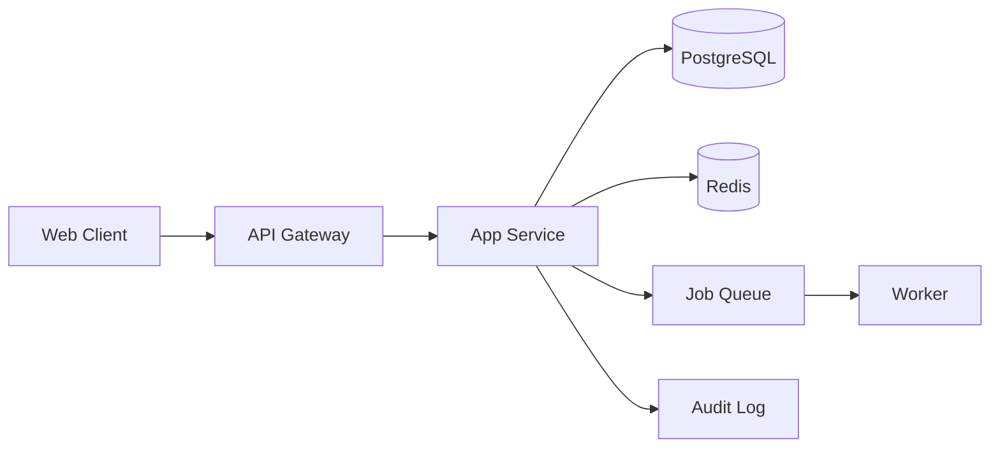

# ARCHITECTURE

## 技术栈
- Frontend: Next.js 16 + React 19
- Backend: Node.js + TypeScript
- DB: PostgreSQL
- Middleware: Redis (cache/ratelimit), Queue (async jobs)

## 系统拓扑

## 扩展性策略
- 应用层无状态，支持水平扩展
- 热点查询走 Redis 缓存，TTL 30-120s
- 异步任务解耦非关键链路

## API 版本策略
- 统一前缀: /v1
- breaking change 走 /v2
- 写接口默认要求 Idempotency-Key
